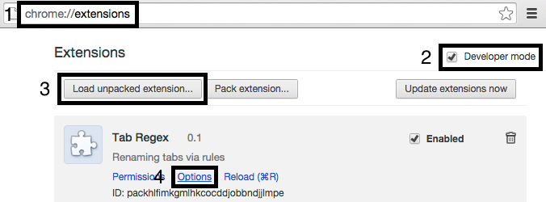

# Tab Regex

Advanced utility for renaming titles on tabs for Chrome. Useful for sites that do not have helpful naming conventions such as Bitbucket or GitHub for those with many tabs or smaller screens. Uses regex rules for replacing the titles and renames on the first match.

## Installation

1. Go to [chrome://extensions](chrome://extensions)
2. Enable developer mode
3. Download [the project](https://github.com/ricmatsui/tab-regex/archive/master.zip), unzip, and load the unpacked extension 
4. Select Options to edit the rules

## Sample Rules

### Bitbucket

    /* Bitbucket Rules */
    // Source
    ([^/]+)\s+/\s+([^/]+)\s+/\s+source(.*)(Bitbucket)-->s / $2 / $1$3$4
    // Issues
    ([^/]+)\s+/\s+([^/]+)\s+/\s+issues\s+/\s+#(\d+)(.*)(Bitbucket)-->i$3 / $2 / $1$4$5
    ([^/]+)\s+/\s+([^/]+)\s+/\s+issues(.*)(Bitbucket)-->i / $2 / $1$3$4
    // Basic
    ([^/]+)\s+/\s+([^/]+)(.*)(Bitbucket)-->$2 / $1$3$4
